# Releasing widget changes

_Last updated: 2026-09-06_

Both the **Ask Benny embed** (`askbenny-convai`, `dist/index.js`) and the
**Partner-branded embed** (`website-widget`, `dist/website.js`) are active and fully
supported. Every embed release builds both formats together.

## Release flow

```mermaid
flowchart LR
  C[Core changes and tests] --> CR[Core release PR: choose version]
  CR -->|Merge to main; validation passes| CN[Publish exact core version to npm]
  CN --> ES[Embed Sync core workflow]
  ES --> EP[PR: exact npm dependency, lockfile, both bundles]
  EP -->|Review and merge; validation passes| EN[Publish exact embed version to npm]
  EN --> PS[Partners Sync published widget runtime]
  PS --> PP[PR: runtime and checksum manifest]
  PP -->|Review and merge| D[Existing Partners deployment pipeline]
```



The publishing workflows never bump versions themselves. They publish the exact
stable version committed to `package.json`, after tests and builds succeed. If
that version is already on npm, it is not republished. Registry errors stop the
workflow; only a 404 means the version is unpublished. No feature branch or PR
publishes a package.

A published version reaches the next repository through either an immediate
`repository_dispatch` event (when `WIDGET_RELEASE_TOKEN` is configured), or an
hourly registry check. GitHub can delay scheduled runs. You can run each sync
workflow manually for an immediate check. All downstream changes remain reviewable
PRs; no workflow approves or merges them.

## Release a core change

1. Make the core change and tests in a PR; merge after Widget CI passes.
2. In **convai-widget-core → Actions → Prepare package release → Run workflow**,
   select `main` and choose `patch`, `minor`, or `major`.
   ```sh
   gh workflow run prepare-release.yml --repo askbenny/convai-widget-core --ref main -f bump=patch
   ```
3. Review the `codex/package-release` PR. It contains the chosen version and
   corresponding package metadata. Merge it after validation.
4. **NPM Publish** validates again, builds with the configured Ask Benny API/socket
   endpoints, publishes that exact version, and records a GitHub release.
5. Embed's **Sync core package** opens/updates `codex/update-widget-core`. It pins
   the exact npm core version, updates the lockfile/provenance, and builds both
   embed bundles. It bumps embed's patch version if the current embed version is
   already published; an unpublished version is kept. Review and merge that PR.
6. Embed publishes its new version. Partners' **Sync published widget runtime**
   downloads that published package, verifies npm SHA-512 integrity and the
   bundle's SHA-256/source manifest, and opens `codex/update-widget-runtime`.
7. Review and merge the Partners PR. Its ordinary deployment workflow serves the
   updated widget from connected portal hostnames; the manifest changes the runtime
   cache-busting URL. Existing installed snippets keep working.

You may instead include the intended version change in the feature PR. Use
`pnpm release:prepare patch` (or `minor`/`major`), build, and commit the changed
metadata. Merging a new version to `main` runs the same publishing workflow.
Do not add `[skip ci]` to release commits.

## Release an embed-only change

Use **convai-widget-embed → Prepare package release**, review and merge its release
PR, then review the automatically generated Partners runtime PR. A core release
is unnecessary when core did not change.

```sh
gh workflow run prepare-release.yml --repo askbenny/convai-widget-embed --ref main -f bump=patch
```

For third-party dependency updates, change the dependency and pnpm lockfile in
the owning package, pass that package's CI, and follow its normal release flow.
Core pins its external Preact, Signals and voice SDK dependencies to exact tested
versions; Sync core carries those pins into embed’s overrides automatically. Use
`pnpm add --save-exact` when updating these dependencies.
Changes to a dependency or source file do not silently publish an unchanged
package version. Partners-only editor/API changes follow the normal Partners
PR/deployment process and need no npm release unless the widget runtime changes.

## Run a sync immediately

```sh
# Omit version to select the latest stable release.
gh workflow run sync-core.yml --repo askbenny/convai-widget-embed --ref main -f version=1.5.0
gh workflow run sync-widget.yml --repo askbenny/partners --ref main -f version=1.5.0
```

Only exact stable versions are accepted; ranges, prereleases and arbitrary URLs
are rejected. Stale events do not downgrade the current pin. Each workflow uses
a fixed automation branch so repeated runs update its existing PR.

## First rollout of the Website Agent changes

Core and embed `1.5.0` were not published when these PRs were prepared. The embed
PR therefore retains its tested `file:vendor/...tgz` bootstrap dependency so it
can build before core is released. This is **not** the ongoing release mechanism.

1. Merge the core PR first and confirm **NPM Publish** publishes core `1.5.0`.
2. Merge the embed workflow PR. Its publishing step deliberately waits while the
   bootstrap dependency is present. Run **Sync core package** (or wait for the
   scheduled check), review its PR, and merge it.
3. That sync replaces the file dependency with an exact registry version and
   removes the core archive. Embed can now publish `1.5.0`.
4. Merge the Partners feature/workflow PR, then run **Sync published widget
   runtime** to import the npm release (or let its hourly check do so).

The local snapshot helpers remain available for pre-publication development;
using one deliberately restores a bootstrap state and blocks embed publishing
until the npm sync replaces it. No npm publish or production deployment was
performed while implementing this automation.

## One-time repository setup

- Keep the existing `NPM_TOKEN` secret in core and embed, or configure npm trusted
  publishing for that repository's `npm-publish.yml`. The workflow uses Node 24,
  an OIDC permission and provenance. The token, if configured, is passed only to
  the npm publishing step.
- Core also needs the existing `VITE_SERVER_URL*` and `VITE_WEBSOCKET_URL*` secrets
  for published Ask Benny endpoints. CI tests use intercepted fixture endpoints;
  publishing builds use the production secrets.
- In all three repositories, enable **Settings → Actions → General → Workflow
  permissions → Allow GitHub Actions to create and approve pull requests**.
  The workflows request scoped permissions and only create PRs; they never
  approve or merge them. Organization policy may control this setting.
- Optional: configure `WIDGET_RELEASE_TOKEN` in the three repositories for
  immediate release notifications and ordinary bot PR events. Use a token scoped
  to these repositories with Contents, Pull requests and Actions read/write.
  Without it, same-repository `GITHUB_TOKEN` and hourly/manual syncs still work.
  The workflows explicitly dispatch CI on generated PR branches because events
  created with `GITHUB_TOKEN` do not behave like ordinary user pushes; GitHub may
  also require approval of bot-created PR workflow runs.
- Protect `main` with required validation and human review. Workflows must be
  merged into the default branch before GitHub enables dispatch/schedules.

References: [GitHub workflow triggers](https://docs.github.com/en/actions/how-tos/write-workflows/choose-when-workflows-run/trigger-a-workflow),
[create-pull-request permissions](https://github.com/peter-evans/create-pull-request#workflow-permissions),
[npm trusted publishing](https://docs.npmjs.com/trusted-publishers/).

## Checks, retries and rollback

Core CI runs release-tool tests, the Chromium widget suite, lint/types and build.
Embed CI runs release-tool tests, entrypoint tests, types/lint and both builds.
The Partners sync runs its full tests, typecheck, lint and browser E2E before
opening a runtime PR. Normal Partners tests also enforce the runtime checksum.
No release is approved merely because its manifest exists.

If npm succeeds but recording the GitHub release/notification fails, rerun
**NPM Publish** on `main`. It skips the existing npm version, uses that version's
recorded source commit for the GitHub release, and can notify downstream again.
The scheduled checks also recover a missed notification. Never overwrite an npm
version; publish a higher version for fixes.

Prefer a forward fix. For an urgent portal rollback, pause **Sync published
widget runtime**, restore a previously verified runtime **and its matching
manifest** in a Partners PR, test/deploy it, and re-enable sync after the fixed
higher npm version is ready. Reverting only one of the two files fails integrity
validation. Sync workflows intentionally refuse automatic downgrades.
